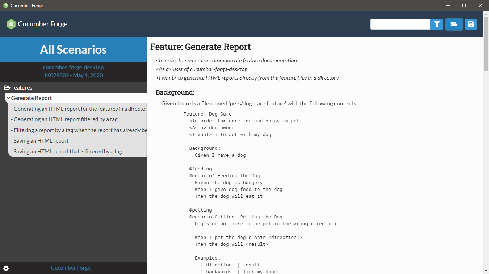

  

<h1 align="center">
  Cucumber Forge Desktop
</h1>

# _About_
Cucumber Forge Desktop allows users to create clean HTML reports without having to build the project or run the tests. Many of the stakeholders involved in the Cucumber documentation process do not need the test pass/fail information for the scenarios. Instead they just want simple reports that are easy to generate, read, and share.

Users of Cucumber Forge Desktop do not need technical knowledge or a development environment. They simply need access to the feature files to include in the report.

# _Usage_

Cucumber Forge Desktop supports generating HTML documents from all of the feature files contained in a selected directory (and its sub-directories). The scenarios included in the report can be filtered by tag.

  

Detailed usage documentation can be found [here](https://engineering.cerner.com/cucumber-forge-desktop/).

# _Availability_

To install and use Cucumber Forge, download the setup executable from the [latest release](https://github.com/cerner/cucumber-forge-desktop/releases).

This project is built on [Travis](https://travis-ci.com/cerner/cucumber-frge-desktop).

# _Building_

Note that Cucumber Forge Desktop is an Electron-based front-end for the [cucumber-forge-report-generator](https://github.com/cerner/cucumber-forge-report-generator) NPM library.

Development Environment:
* [NPM](https://www.npmjs.com/) - ^6.4.1
* [Node.Js](https://nodejs.org) - ^10.14.1

To install the project from the source code, run `npm install` from the project directory.

`npm start` can be used to build and launch the app from the local source code.

Linting is available and can be run via `npm run lint`.

To execute the automated tests, simply run `npm test` from the project directory.

To open the DevTools when the application loads (for debugging purposes) add the following code to the createWindow() function of the main.js file: `mainWindow.webContents.openDevTools();`

# _Conventions_

The project extends the `eslint-config-airbnb` [ESLint](https://eslint.org/) configuration. This provides formatting standards for breaks, line length, declarations, etc.

Tests for the project are written with [cucumber-js](https://github.com/cucumber/cucumber-js) using the [Spectron](https://electronjs.org/spectron) testing framework.

# _Communication_

If you have any issues or questions, please log a [Github issue](https://github.com/cerner/cucumber-forge-desktop/issues) for this repository. See our [contribution guidelines](CONTRIBUTING.md) for tips on how to submit a helpful issue.

# _Contributing_

See [CONTRIBUTING.md](CONTRIBUTING.md)

# _LICENSE_

Copyright 2019 Cerner Innovation, Inc.

Licensed under the Apache License, Version 2.0 (the "License"); you may not use this file except in compliance with the License. You may obtain a copy of the License at

&nbsp;&nbsp;&nbsp;&nbsp;http://www.apache.org/licenses/LICENSE-2.0

Unless required by applicable law or agreed to in writing, software distributed under the License is distributed on an "AS IS" BASIS, WITHOUT WARRANTIES OR CONDITIONS OF ANY KIND, either express or implied. See the License for the specific language governing permissions and limitations under the License.
